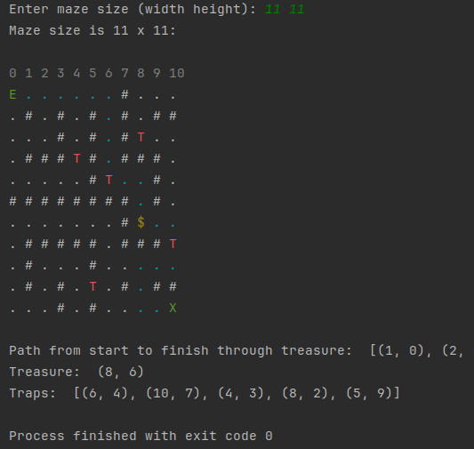

# DistributedLab
## Task 1: Orderbook
Spent about 3 hours

My solution is effective for relatively small list sizes corresponding to the order book. Since the sorting occurs using a built-in sort method written in C, it typically has a time complexity of O(n log n), where n is the number of orders in the corresponding list. However, since we sort after each insertion, the overall time complexity is greatly reduced since the list is nearly sorted most of the time.
However, if the list is expected to grow to 10,000 or more, further optimizations such as binary search trees or the use of parallel processing techniques may be required.

```sh
$  chmod u+x task1_orderbook/task1_orderbook.py
$ ./task1_orderbook/task1_orderbook.py
```
Exsample:

    order_book = Orderbook()

    # sell
    order_book.add_order(Order(1, 20, 24, True))
    order_book.add_order(Order(2, 40, 25, True))
    order_book.add_order(Order(3, 40, 26, True))

    # buy
    order_book.add_order(Order(10, 40, 25, False))
    order_book.add_order(Order(11, 40, 24, False))
    order_book.add_order(Order(12, 40, 23, False))

    # Match orders
    print(*order_book.balance_change(), sep="\n")

Answer:

    BalanceChange{'user_id': 1, 'value': -20, 'currency_string': 'UAH'}
    BalanceChange{'user_id': 1, 'value': 480, 'currency_string': 'USD'}

    BalanceChange{'user_id': 10, 'value': -480, 'currency_string': 'USD'}
    BalanceChange{'user_id': 10, 'value': 20, 'currency_string': 'UAH'}

    BalanceChange{'user_id': 2, 'value': -20, 'currency_string': 'UAH'}
    BalanceChange{'user_id': 2, 'value': 500, 'currency_string': 'USD'}

    BalanceChange{'user_id': 10, 'value': -500, 'currency_string': 'USD'}
    BalanceChange{'user_id': 10, 'value': 20, 'currency_string': 'UAH'}

## Task 2: Maze
Spent about 5 hours

I use the Depth First Search (DFS) algorithm because of its simplicity and effectiveness in creating complex and interesting mazes.
DFS has complexity O(n), where n is the number of cells in the maze. To improve the maze, I loop some sections.
To set the required number of traps and check the availability of the treasure, I use a path checking algorithm that uses breadth-first search (BFS), the time complexity of which is O (n).
```sh
$  chmod u+x task2_maze/maze.py
$ ./task2_maze/maze.py
```


## Task 3: Website analytics
Spent about 2 hours

I'm using a dictionary to store information about the pages visited by each user on day one, which allows us to quickly check the browsing history for each user. We then look at the data for the second day only and check if the conditions are met.

The time complexity of this algorithm is O(n) 
```sh
$  chmod u+x task3_Website_analytics/user_analytics.py
$ ./task3_Website_analytics/user_analytics.py
```
## Task 4: Hitler crawler
Spent about 5 hours

Use asyncio and aiohttp to send request to API Wikipedia.
During the first pass, all links on the start page are searched asynchronously. 
The next pass searches for links in the found pages.


```sh
$  chmod u+x task4_hitler/hitler_crawler.py
$ ./task4_hitler/hitler_crawler.py
```

## Task 5: 
Spent about 8 hours.

I developed two options:

1. It works more precisely because it loads a complete list of all transactions into memory. 
And from this list it forms in the optimal way. 
By using built-in sorting methods and data storage types, it works faster with lists up to 100,000.

This solution has a time complexity of O(n log n) The space complexity is O(n)
```sh
$  chmod u+x task5_backpack/backpack.py
$ ./task5_backpack/backpack.py
```
```
Amount of transactions in the block: 895
The block size: 1047882
The total extracted value: 799948
Construction time: 1.5765289999999998
The max memory: 8448728
```

2. Saves only transactions with the highest specific weight to the pool. thus can handle arrays of any size. 
At the same time, due to the loss of some transactions, the formation of a block may not be effective. 
But this is practically leveled out when using large amounts of source data.
A binary tree is also used to speed up sorting, inserting values and searching for maximum elements.
This algorithm is faster when working with incoming arrays of 100,000 elements or more

This solution has a time complexity of O(n) The space complexity is O(1)
```sh
$  chmod u+x task5_backpack/backpack_unlimited.py
$ ./task5_backpack/backpack_unlimited.py
```
```
Amount of transactions in the block: 895
The block size: 1047756
The total extracted value: 799444
Construction time: 0.5807749999999999
The max memory: 8856
```

